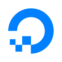

# Hi there 👋

  

Hello! I'm Max Nowack, a seasoned CTO, full stack developer, and technology enthusiast with a diverse background, ranging from Microsoft technologies to modern full stack and DevOps practices.
Currently, I'm the CTO and Co-Founder of VineForecast, dedicated to shaping the technological architecture and driving product development.
With a strong foundation in TypeScript, Node.js, and React, among other technologies, I'm passionate about sharing knowledge and collaborating on innovative projects.
Feel free to explore my repositories and let's push the boundaries of innovation together!

## 👨‍💻 Currently working on

  

  

## 💻 Tech-Stack

  
  
  
  
  
  
  
  

  

    

      show more …
    

  

  

    
    
    
    
    
    
    
    
     
    
    
    
    
    
    
    
    
     
    
    
    
    
    
    
    
    
     
    
    
    
    
    
    
    
    
     
    
    
    
    
    
    
    
    
     
    
    
    
    
    
    
    
    
     
    
    
    
  

